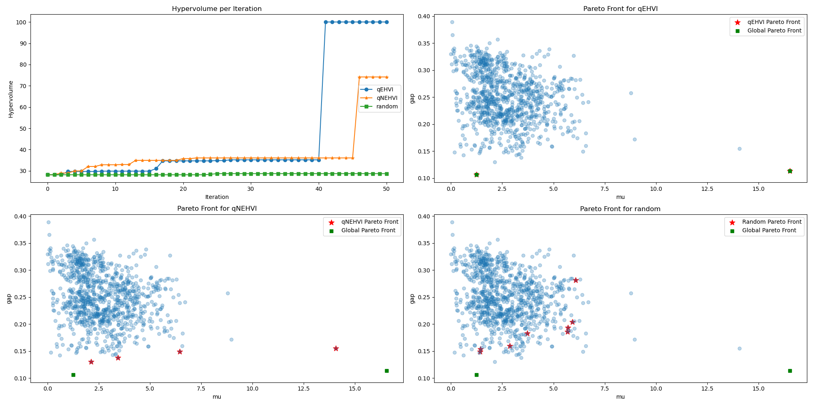

# Investigation of Multi-Objective Bayesian Optimization of QM9 Dataset

This project will investigate the application of multi-objective Bayesian optimization (specifically EHVI- and parEGO-based methods) to benchmark several multi-objective optimization tasks with QM9 dataset. The objective is to develop specific guidelines about the choice of surrogate and acquisition functions in the context of Multi-Objective Bayesian Optimization for molecular property optimization.

References:

Balandat, Maximilian and Karrer, Brian and Jiang, Daniel R. and Daulton, Samuel and Letham, Benjamin and Wilson, Andrew Gordon and Bakshy, Eytan (2020) BoTorch: A Framework for Efficient Monte-Carlo Bayesian Optimization
Raghunathan Ramakrishnan, Pavlo O. Dral, Matthias Rupp & O. Anatole von Lilienfeld (2014) Quantum chemistry structures and properties of 134 kilo molecules

# Results & Discussion

In this work, we used the QM9 dataset (that contains about 134K molecules) to demonstrate the power of EHVI-based algorithms. In the interest of time and computational cost, we used randomly selected 1000 structures. We designed a few multi-objective tasks for this project, which are not necessarily motivated by any scientific design goals. But our results show the promise of using BO for similar kind of multi-objective molecular properties optimization. For featurization, we used the coulomb matrix (CM) and smooth overlap of atomic orbitals (SOAP) methods. For GP kernels, we used RBF, and Matern kernel. We compared three different acquisition functions, namely, 1. qEHVI, 2. qNEHVI, and 3. random data acquisition. In all the simulation results provided below, we used 50 initial random seed points. One main limitation of this work is, due to time constraints, we didn't run the simulation several times to have statistically robust results.

### Effect of featurizer

We tried SOAP and Coulomb matrix (CM) to featurize the molecules. In our study, all things being equal, SOAP outformed CM, owing to the fact that we have to pad the CM with zero's to have the same fingerprint length. As a result, we are introducing spurious features that does not contain any signal and furhter amplifies the noise present in the data.

### Effect of kernel

We used RBF and Matern kernel. In this study, we found that they perform almost equally, with Matern performance being slightly better.

### Maximizing mu (dielectric constant) and alpha (polarizability)

This problem aims to find materials with a high dielectric constant in conjunction to a high polarizability. Below figure shows the optimization profile along with the pareto fronts for all three acquistion functions.

### Maximizing mu and minimizing bandgap

This problem is trying to find the molecules with a high dielectric constant with a low bandgap (high electrical conductivity).

### Maximizing mu and minimizing Gibbs Free Energy

This problem is trying to find the most stable (low G) molecules with a high dielectric constant.

From the three experiments, we found that both `qeHVI` and `qNEHVI` performed better than the random acquisition function.
